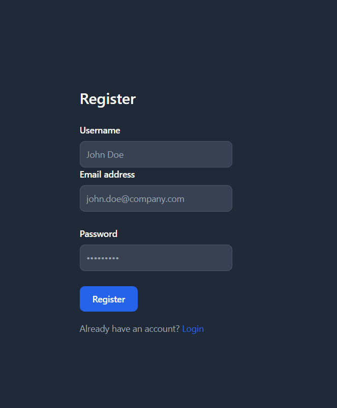
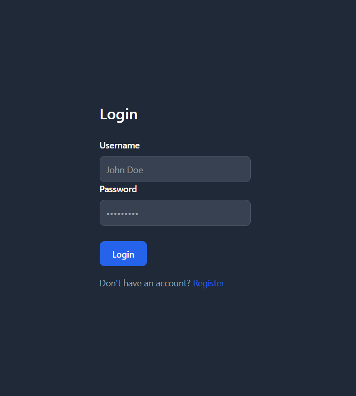
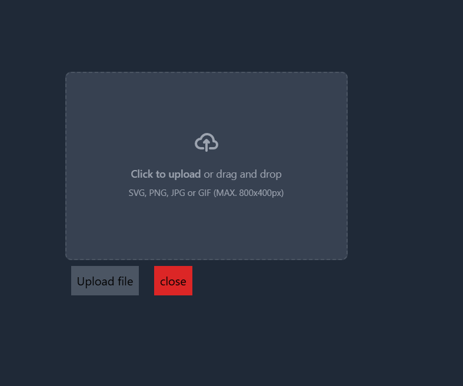
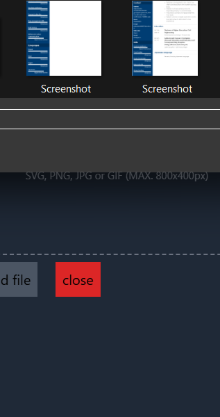
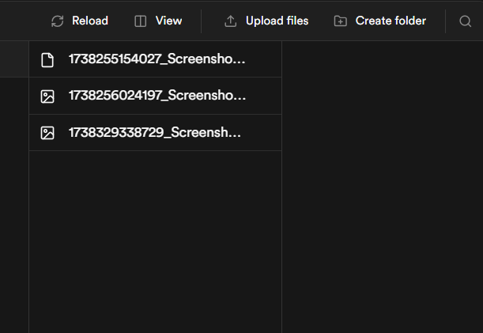

Google Drive Clone - Project Description
🚀 Project Overview
The Google Drive Clone is a cloud-based file storage and management application that allows users to upload, organize, and access their files securely from anywhere. This project replicates key features of Google Drive, including file uploads, folder management, user authentication, and real-time file sharing.

🎯 Features
✅ User Authentication - Secure login/signup system with JWT authentication.
✅ File Upload & Storage - Users can upload, download, and delete files.
✅ Folder Management - Organize files into folders like in Google Drive.
✅ Real-time Collaboration - Share files and folders with other users.
✅ File Preview - View images, PDFs, and text files within the app.
✅ Search & Filter - Easily find files using search and filters.
✅ Responsive UI - A clean and user-friendly interface built with React.
✅ Secure Access Control - Permissions for viewing and editing files.

🛠️ Tech Stack
Frontend: React.js, Tailwind CSS
Backend: Node.js, Express.js
Database: MongoDB (Mongoose ORM)
Authentication: JWT 
Storage: supabase / alternative to firebase

📌 Future Enhancements
🔹 Drag & Drop File Upload
🔹 Version Control for Files
🔹 Integration with Third-Party Apps (e.g., Google Docs, Dropbox)
🔹 Offline Mode for Accessing Files

🎯 Ideal Use Case
This project is perfect for learning full-stack development with the MERN stack. It also serves as a portfolio project showcasing authentication, file storage, and cloud functionality.

